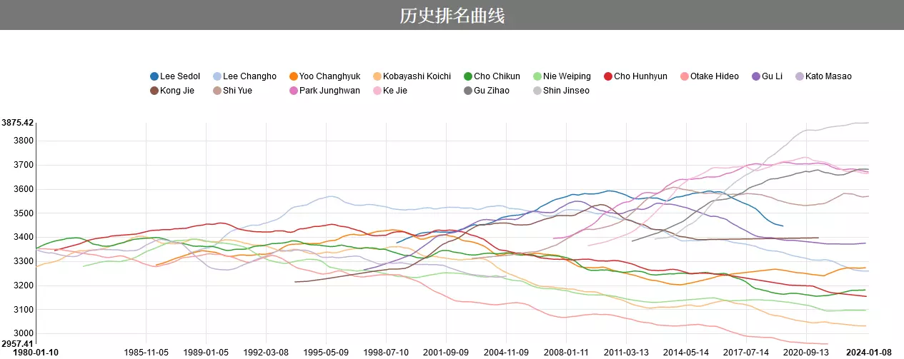

# 天份 vs 才華

通靈王就有一句台詞說巫力不是訓練出來的，而是一個人潛在的力量。意思是指那些訓練，並不是在提高上限，而是在將自己的潛能釋放。

先說明天份和才華兩者的差別，可用下圖來直觀天份跟才華的差異：  
  
(圖片來源：[Go Ratings](https://www.goratings.org/zh/history/))

ELO是用來衡量一個棋手實力的估算指標，ELO值的計算大致上是贏過越強的人，ELO上升越快，贏過不強的人，不太增加；反之輸給很低的人，會扣分很快，輸給實力差不多的，下降幅度不大。  
大概給個上界，Alpha Go李版ELO約3739、Alpha Master約ELO 4858、AlphaGo Zero 約ELO 5185。李世石退役時大約ELO 3445，申真諝現任第一ELO 3876。

從這個圖可以看到不同圍棋手頂尖實力上升下降的狀態。可以看到現任第一人申真諝Shin Jinseo ，從2014之後幾乎是一條斜直線往上衝，直到最近才開始趨緩。朴廷桓Park Junghwan，柯潔Ke Jie也有這種斜線上升期，近年進入了高原期。也有選手上升後下降。  
(這個排名只節錄部分的頂尖棋手，當然這些都是拿過世界冠軍的。)

有了這個視覺上的認知之後，可以來解釋天份和才華的差異：
* 才華是一個持續進步的狀態，說一個人有才華，在這個脈絡下，指的是還在正斜率的狀態，實力持續增加的狀態。說一個人很有才華，意思是這個斜率很大，進步很快。
* 天份是一個選手的上限，說一個人有天份，在這個脈絡下，會指一個人上限很高。

## 才華
我們所謂的很有才華，往往就是看到一個人快速進步，甚至超過原本有在練的人。不過這只是因為那些原本在練的人，通常只是都沒有在做有效的練習。

那些有才華的人，可以說抓到了檢視缺陷的方法，不斷地改進自身。

提升對各種事情的高度，都能拉高才華的上限。比如對於藝術有理解的人，可能在物理學化學領域提出新的見解。  
比如在藝術領域，審美就是一個才華，你的進步速度，取決於自身審美。審美理解深的人，才知道自己還有很多可以進步的地方。  
或者一個建模師，如果有三段四段的畫功，往往能做出比較好的模型。  
有些繪師會透過學電影色調、攝影構圖，來提高自己的審美。

## 天份
天份可以說幾乎是基因和遺傳決定的。

比如聽力細胞比較發達的人，對於聲音的感受就會比其他人強，當然他們的音樂上限就比較高。

味覺細胞比較發達的人，做食物就比較容易區分味道。有些人不擅長料理的原因，是因為分辨不出來食物味道差異。

絕大多數的人，現階段都是遠遠不達自己的天份上限。比如肌力體能，人體是天生具有深蹲硬舉兩三百公斤的潛力，目前大多數的人不要說兩百公斤，連自己的兩倍體重都還扛不起。

一般人能做的，就是透過訓練讓自身逼近天生的極限。這個進步的速度，就是一種才華。

只有已經持續訓練，持續進步到自身天生極限的人，才有資格說自己沒有天份，就如同那些頂尖的人ELO在長時間正斜率進步之後，進入了一個高原期。