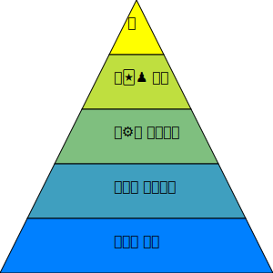
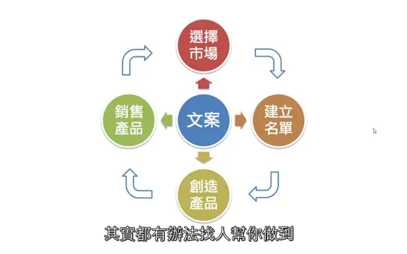
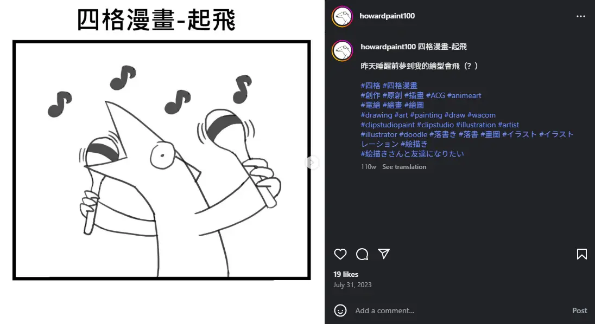
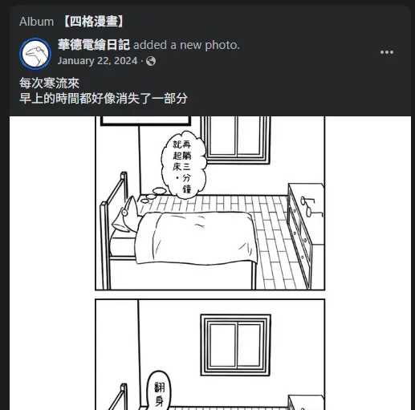

# 個人品牌行銷

* 前情提要
  * 一門專業技術
  * 核心能力：Resilience
    * 人生哲學
    * 放棄設定目標
  * 主要書單
    * 普通人的財富自由之道
      * 
  * 

* Exploration
  * Temet Nosce   
  * Jim Rohn --“Formal education will make you a living; self-education will make you a fortune.”
    * 做實驗
    * 探索自我
    * 嘗試不同的可能性
  * <iframe width="450" height="255" src="https://www.youtube.com/embed/zWk69IPsMQs" title="如何超过99%的人: 时间管理的奥秘" frameborder="0" ></iframe> 
  * 羞愧法則
  * Homework
    * 內容形式多樣性： 文章、短影音、長影片、Podcast、社群貼文等。

* Marketing
  * 怎樣是好的行銷文?
    * 
  * SEO
    * 主要引用資料
      * Jemmy Ko - 讓人一搜尋就找到你
      * 邱韜誠 - SEO白話文
    * Google 的 "E-E-A-T" 原則
    * 「關鍵字 流量」＝「關鍵字 搜尋量」x「關鍵字 點閱率(排名)」
    * SEA + SEO = SEM
      * 主動推播 vs 被動推播
      * 花錢下廣告廣撒 vs 花時間產內容精準集中TA
      * 短期流量流量型 vs 長期成效產品型
    * 搜尋意圖
      * TA導向原則
      * "乾我屁事"原則
        * TA設定搜尋情境
        * 解決問題導向
      * 理解使用者
        * 負評
          * steam, google,
            * 不能葉配味道
  * TA (Target Audience)
    * 特徵消費者 (Representative Consumer)
    * 點估計 (Point Estimate)
    * 普通人的財富自由之道
      * 
  * Homework
    * 觀察市場 市場在哪?
    * 參考其他人怎麼往市場調整
    * 如何將自己往市場調整?

* 逆向工程
  * 定義與目的
    * 從成功案例中拆解策略
    * 找出核心成功因素
    * 減少試錯成本
  * 目標設定
    * 明確品牌定位
    * 明確受眾 TA
    * 明確行銷目標：流量、轉換、影響力
  * 分析流程
    * 案例選擇
      * 競爭對手
      * 同領域成功創作者
      * 不同行業的優秀案例
    * 拆解策略
      * 內容形式：文章、影片、Podcast
      * 發佈節奏與頻率
      * 互動策略：留言、社群、抽獎、投票
      * SEO / 標題 / 描述 / 標籤
      * 視覺風格與品牌一致性
  * 模式萃取
    * 成功模式
    * 主題選擇（解決問題型、娛樂型、知識型）
    * 內容長度與深度
    * CTA（行動呼籲）策略
  * 範例：華德電繪日記 https://www.instagram.com/howardpaint100/
    * 
    * 
  * Homework

 
* 策略深度
  * YT不同時期算法
    * 2006-2010年：
      * 初期發展，YouTube內容多樣但不專業，用戶尋求新奇和娛樂性。
    * 2011-2014年：
      * 內容創造者崛起，YouTube推出合作夥伴計劃和直播功能，平台推廣長影片。
    * 2015-2019年：
      * 多樣化內容時期，平台推廣中短影片，大頻道多角觸及。
    * 2020年至今：
      * 後疫情時代，專業領域的小頻道成為主流。
      * 分眾化時代
    * 2030 ~ ?：
      * MR時代