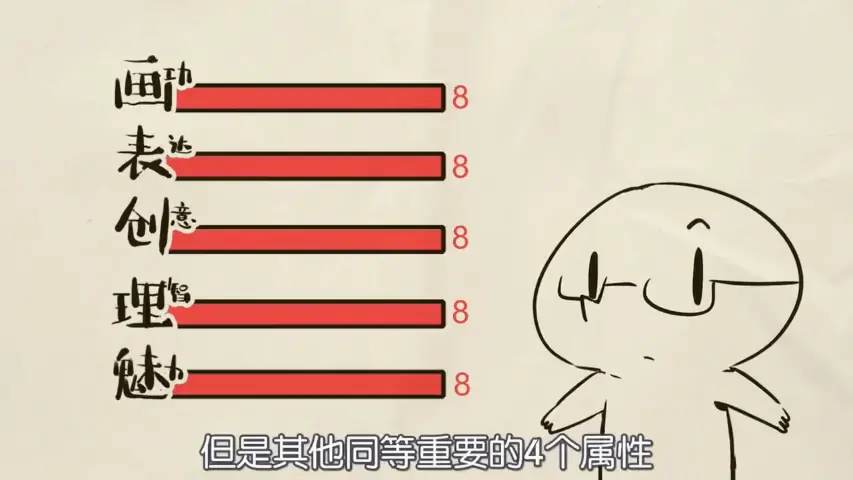
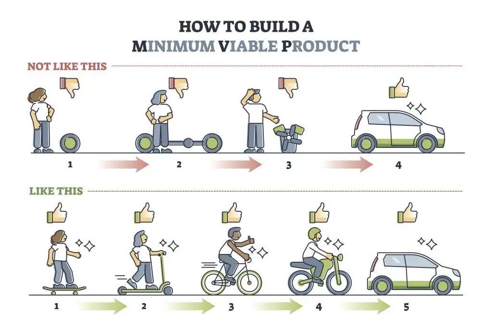
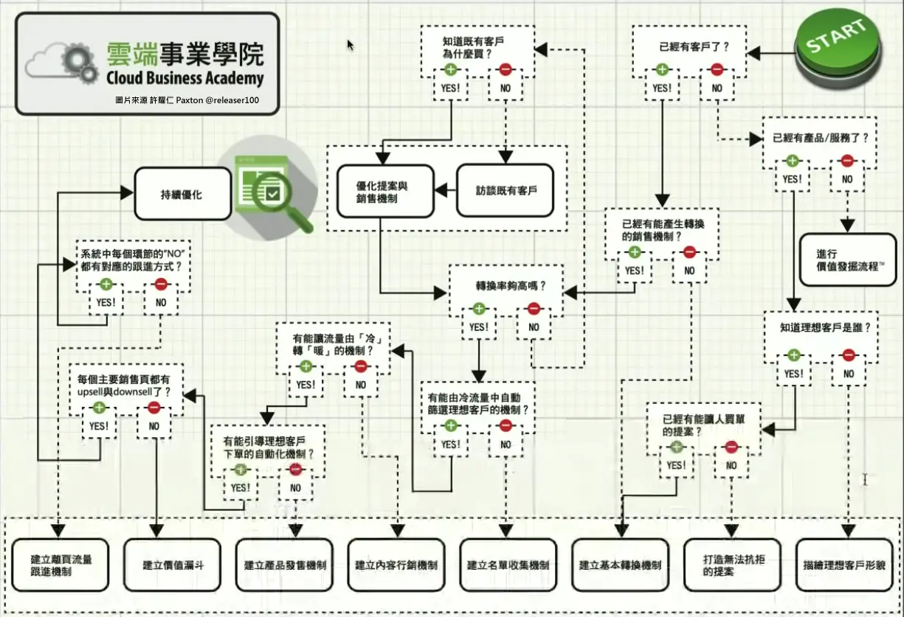

# 個人品牌行銷

* 前情提要
  * 一門專業技術
    *  
  * 核心能力：Resilience
    * 人生哲學
  * 賺到錢，順便學會XXX
    * 放棄能力主導思維
  * 主要書單
    * 普通人的財富自由之道
      * 
  * 
    * 任何一層卡關，都要往下看"所有層"
    * ex: 酷思特
  * 
    * <iframe width="450" height="255" src="https://www.youtube.com/embed/AIufILDRw5U" title="【画成啥样能有收入？0基础咋开始？RPG一样的提升画技全攻略【抖抖村】How to Start Drawing for Beginners" frameborder="0" ></iframe> 
    * <iframe width="450" height="255" src="https://www.youtube.com/embed/Fr_5snieXYw" title="【抖抖村】真!到底什么水平才能靠画画吃饭? How Good Should You Be In Order To Make a Living On Drawing/Making Art" frameborder="0" ></iframe> 
  * 羞愧法則
    * 

* Exploration
  * Temet Nosce   
    * 探索自我
  * 做實驗
    * Jim Rohn --“Formal education will make you a living; self-education will make you a fortune.”
    * 嘗試不同的可能性
  * 輸出導向
    * 吸引力法則
    * <iframe width="450" height="255" src="https://www.youtube.com/embed/5kNCcpM61eo" title="小心效率陷阱：為什麼你不需要第二大腦或者個人知識庫？" frameborder="0" ></iframe> 
  * Homework
    * 尋找更多喜歡的內容? 為什麼? 有什麼特徵?
    * 如果靈感枯竭，如何尋找新的內容題材？
    * 內容形式多樣性： 文章、短影音、長影片、Podcast、社群貼文
      * [舉例A](https://www.facebook.com/AlchemyMage), [舉例B](https://www.youtube.com/@HomunMage/videos), [舉例C](https://podcasts.apple.com/tw/podcast/latticemage/id1693061816)
    * 目標：至少三個平台 每個平台至少5個內容 (記得羞愧法則)
      * 爛產出舉例 https://www.tiktok.com/@latticemage

* Marketing
  * 行銷
    * 怎樣是好的行銷文?
    * "乾我屁事"原則
      * PAS 架構指示：
        *  Problem (問題)： 明確指出目標受眾遇到的問題。
        *  Agitate (激化)： 激化問題的嚴重性，引起共鳴。
        *  Solution (解決方案)： 提供解決方案，並強調客戶的產品/服務的優勢。
    * 
  * SEO
    * 主要引用資料
      * Jemmy Ko - 讓人一搜尋就找到你
      * 邱韜誠 - SEO白話文
    * Google 的 "E-E-A-T" 原則
    * 「關鍵字 流量」＝「關鍵字 搜尋量」x「關鍵字 點閱率(排名)」
    * SEA + SEO = SEM
      * 主動推播 vs 被動推播
      * 花錢下廣告廣撒 vs 花時間產內容精準集中TA
      * 短期流量流量型 vs 長期成效產品型
    * 搜尋意圖
      * TA導向原則
        * TA設定搜尋情境
        * 解決問題導向
      * 理解使用者
        * 負評
          * steam, google,
            * 不能葉配味道
  * TA (Target Audience)
    * 特徵消費者 (Representative Consumer)
    * 點估計 (Point Estimate)
    * 普通人的財富自由之道
      * 
    * <iframe width="450" height="255" src="https://www.youtube.com/embed/0pFrpYK5SzY" title="自己画的好没人看，别人画的烂却被吹捧？如何推广自己的作品【抖抖村】How to Promote Your Artwork and Comics" frameborder="0" ></iframe> 
  * 舉例：YT不同時期算法
    * 2006-2010年：
      * 初期發展，YouTube內容多樣但不專業，用戶尋求新奇和娛樂性。
    * 2011-2014年：
      * 內容創造者崛起，YouTube推出合作夥伴計劃和直播功能，平台推廣長影片。
    * 2015-2019年：
      * 多樣化內容時期，平台推廣中短影片，大頻道多角觸及。
    * 2020年至今：
      * 後疫情時代，專業領域的小頻道成為主流。
      * 分眾化時代
  * 範例：觀察市場
    * <iframe width="450" height="255" src="https://www.youtube.com/embed/jz7oz15Dddw?start=458" title="三国题材游戏美术的深度思考——游戏制作人冬冬专访" frameborder="0" ></iframe> 
  * Homework
    * 觀察市場 市場在哪?
      * 你的TA表

* 逆向工程
  * <iframe width="450" height="255" src="https://www.youtube.com/embed/zWk69IPsMQs" title="如何超过99%的人: 时间管理的奥秘" frameborder="0" ></iframe> 
  * 定義與目的
    * 從成功案例中拆解策略
    * 找出核心成功因素
  * 目標設定
  * 分析流程
    * 案例選擇
      * 競爭對手
      * 同領域成功創作者
      * 不同行業的優秀案例
    * 拆解策略
  * 模式萃取
    * 成功模式
      * 
    * 主題選擇（解決問題型、娛樂型、知識型）
    * 內容長度與深度
    * CTA（行動呼籲）策略
  * 範例：家寧 vs Andy老師
    * <iframe width="450" height="255" src="https://www.youtube.com/embed/sYnFQrP7RLE?start=1172" title="家寧 vs Andy老師" frameborder="0" ></iframe> 
  * 範例：華德電繪日記 https://www.instagram.com/howardpaint100/
    * 
    * 
  * Homework
    * 製作沙盒(sandbox)
    * Documentation and Modeling
    * 嘗試調整之前的內容 或者發佈新內容 但要應用你分析別人內容的觀念
 
* 策略深度
  * 你的招不能用的時候怎麼辦？
    * 預備方案 (Contingency Plan)：
    * 平台限制： 如果某個平台演算法改變，導致觸及率下降，我該如何將內容轉移到其他平台？
    * 時間壓力： 如果時間不夠，哪些內容形式可以快速產出？（例如：文字貼文、簡單的短影音、社群問答）
    * 工具限制： 如果無法使用某些專業工具，是否有替代方案？
  * 實驗的方法
    * A/B Test (Black Box Testing)
    * sandbox
  * 能夠快速切換或結合不同形式
    * 針對不同平台和受眾調整 
  * 跨平台整合策略
    * 一魚多吃原則
      * 同一素材，不同平台演繹
      * 長影片 → 短影音 → 圖文 → Podcast
  * 內容組合拳戰略
    * 漏斗行銷
      * 3H 
        * Hero： 使用專業、深入的語言，提供獨到的見解。
        * Hub： 使用平易近人的語言，提供實用的資訊。
        * Hygiene： 使用簡單易懂的語言，快速解答問題。
    * 飛輪效應
    * 商業模式    
  * Homework
    * 現在手上的牌 分析能用的狀況 不能用的時候換哪招? 要去逆向工程甚麼資源來補足?
