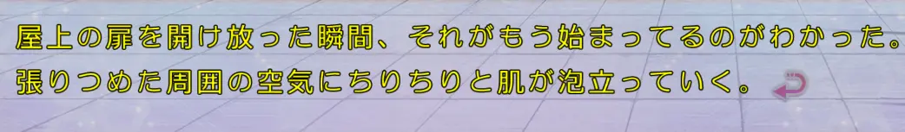
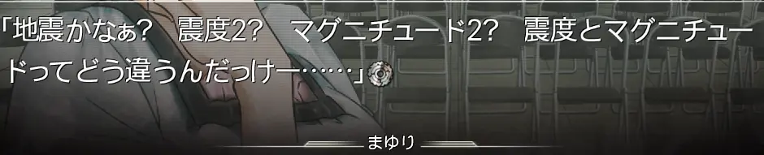

## Language Reactor

## Procedural knowledge

* [如何停止翻譯？用英文思考的真相 🧠 語言學觀點分析 // Chen Lily](https://www.youtube.com/watch?v=WxYnyqgO77M)
  * Declarative knowledge vs Procedural knowledge

[為何講英文常常要組織很久😥 ？// Chen Lily](https://www.youtube.com/watch?v=XyvhHth6FYQ)

## 系統2 vs 系統1

https://www.youtube.com/watch?v=O9fGrstjt8k

延伸閱讀 https://alchemy.posetmage.com/Content/Article/Social%20Science/Psychology/Cognitive/Tacit%20Knowledge.html

## 過擬合(Overfitting) vs 泛化(Generalization)

## 髓鞘化(Myelination)

https://zh.wikipedia.org/zh-tw/%E9%AB%93%E7%A3%B7%E8%84%82

