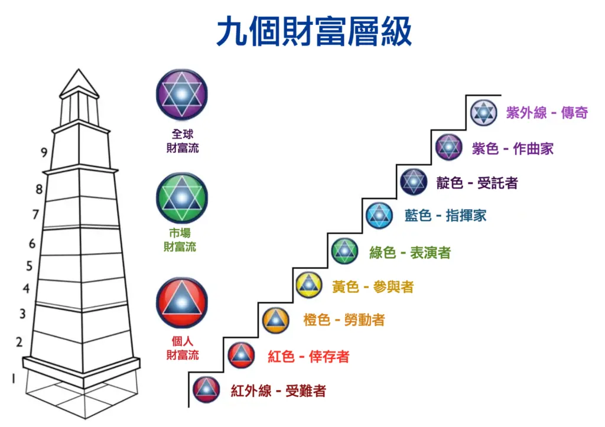
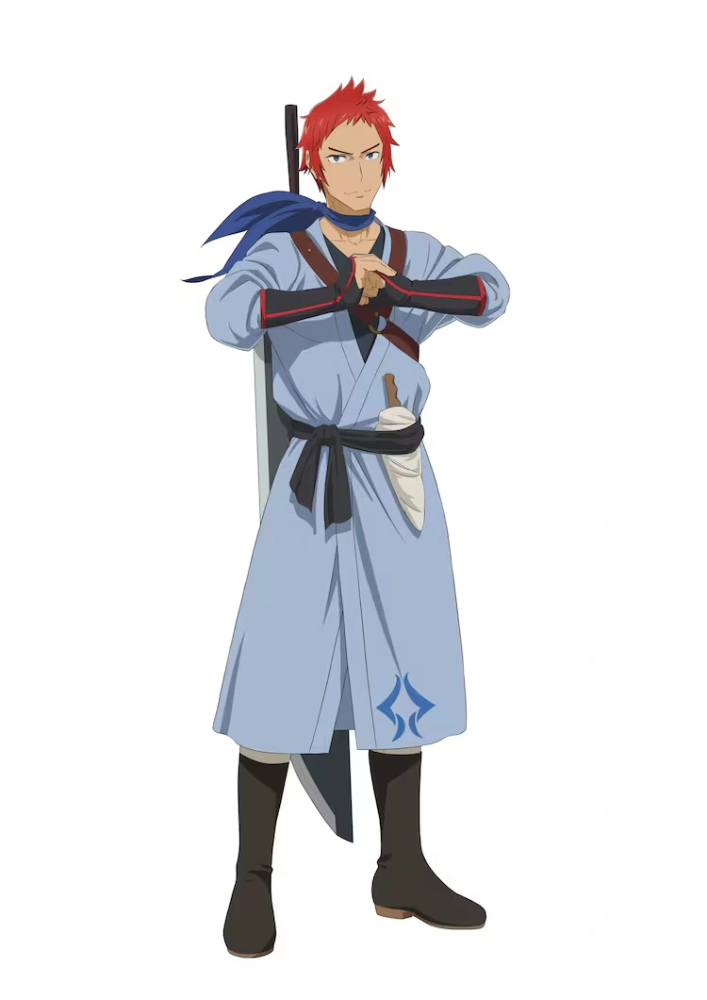
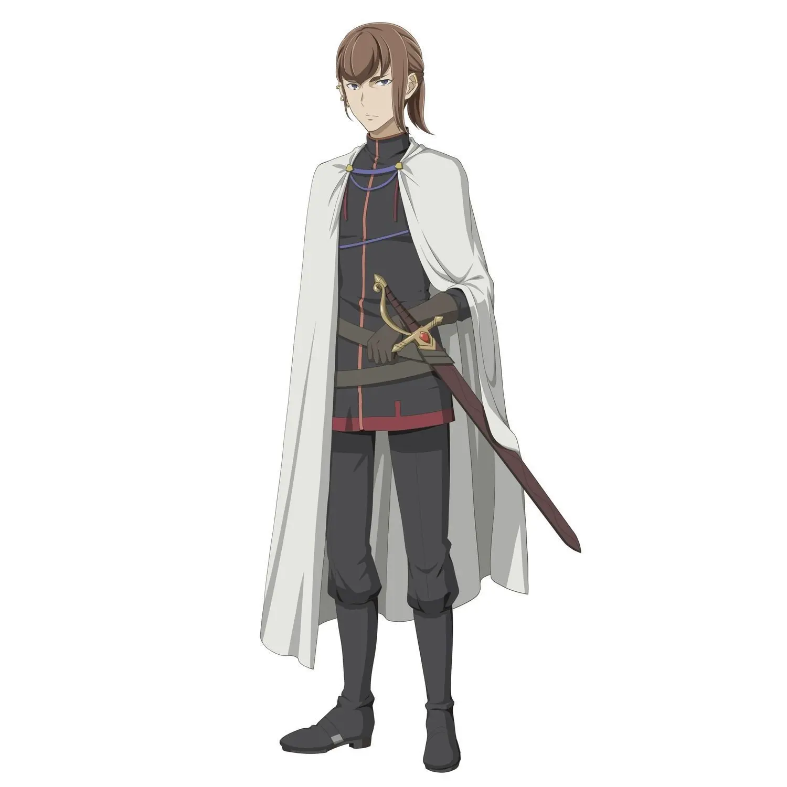
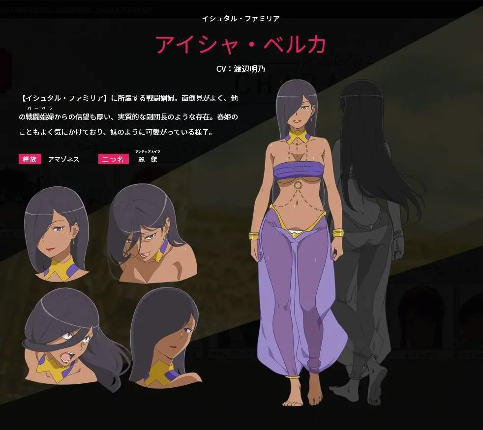
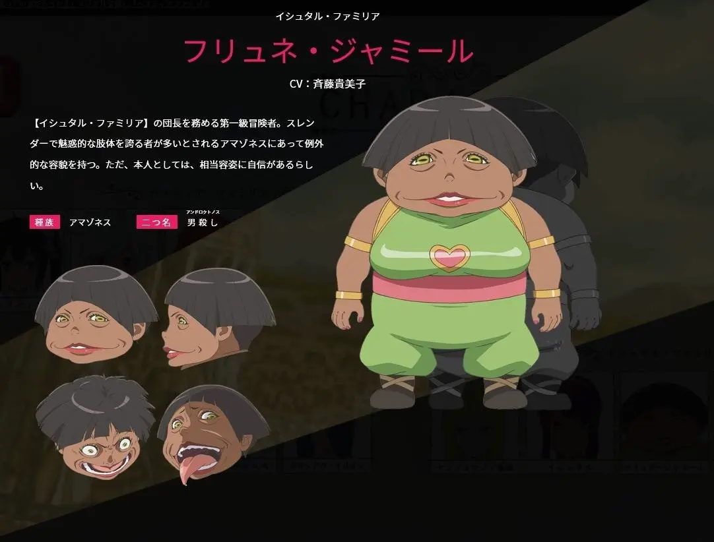
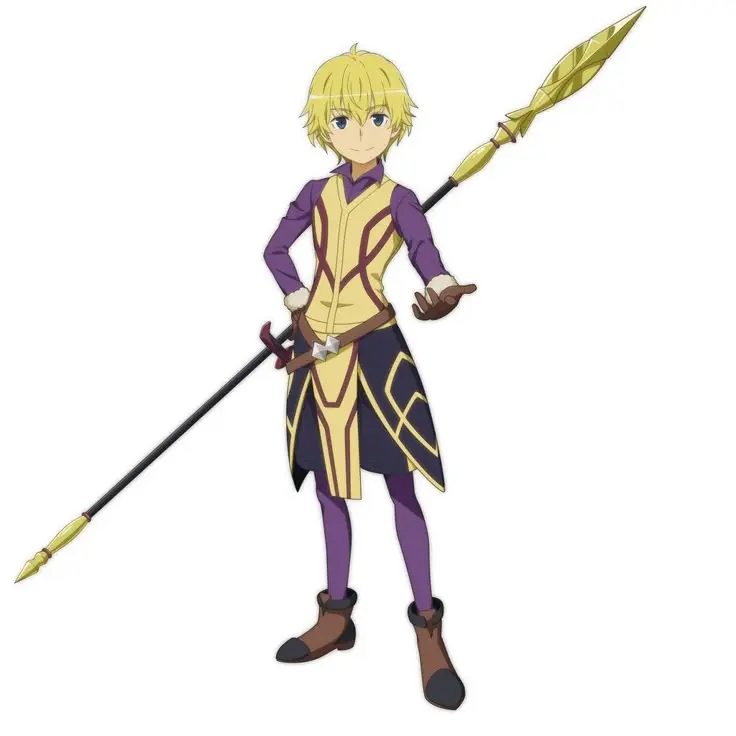
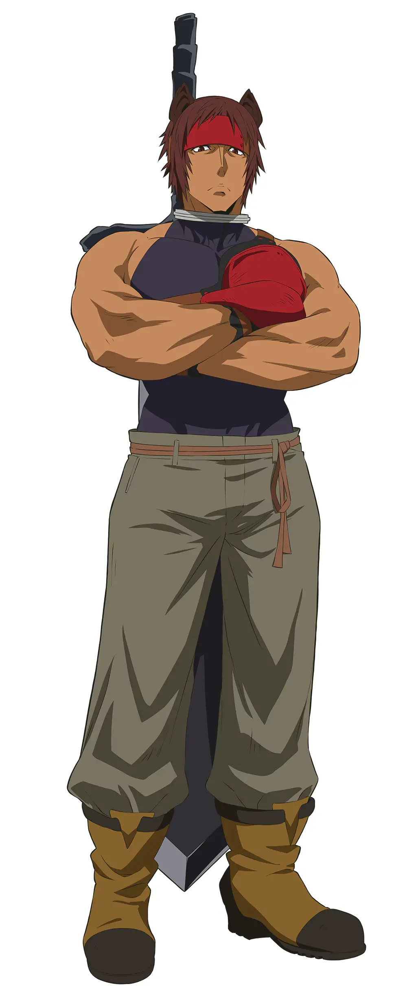

## 財富等級

*   **紅外線（Infrared）：學習與生存。** 這是起點，也是掙扎。你可能還在摸索，或者僅僅是為了生存而努力。影響力？幾乎為零。
*   **紅色（Red）：時間換錢，工廠/打卡人生。** 這是最常見的區間，80% 的人困在這裡。你的收入直接與你投入的時間掛鉤，日復一日，年復一年。
*   **橙色（Orange）：專業價值階段。** 恭喜你！你開始創造「付費的價值」。你能解決問題，市場願意為你的專業買單。這是創業的入門，但離真正的「系統化」還有距離。
*   **黃色（Yellow）：系統化階段。** 這是一個關鍵的飛躍！你的收入和影響力開始脫離個人時間，透過系統、流程、團隊，實現可複製、可擴張。
*   **綠色（Green）：擴張型企業家。** 你不再管理單一系統，而是指揮多個「一人團隊」或「AI 驅動的系統」，收入多元化，影響力擴及企業或市場。
*   **藍色（Blue）：投資者。** 讓錢為你工作，你的重心轉向資本運作和資產增值。
*   **靛色（Indigo）：導師/影響力放大者。** 你開始教導、啟發他人，用你的經驗和知識影響社群或行業。
*   **紫色（Violet）：願景創造者。** 你用長遠的願景引導社會系統，影響力擴及產業或大型組織。
*   **白色（White）：精神領袖/全球意識。** 你達到財富、影響力與使命的終極整合，你所做的，是改變整個文明的遊戲規則。

## 歐拉麗冒險者影響力

* Lv1: 下級冒險者（下級冒険者）
  * 在歐拉麗中有大半冒險者都屬於Lv.1
  * 相當於兼差或者一般工作者
* Lv2: 第三級冒險者
  * 具有中上級別的實力
  * 相當於專業工作者，薪水比一般工作者高一階 但仍然是社畜
  * 舉例 主角基友
    * 
* Lv3: 第二級冒險者
  * 影響力是團隊等級
  * 「阿波羅眷族」團長
  * 
* Lv4: 第二級冒險者
  * 舉例「伊絲塔眷族」阿伊莎能在不同的團隊都發揮影響力，
  * 
* Lv5: 第一級冒險者
  * 舉例「伊絲塔眷族」團長 芙里尼·賈米爾，基本上眷族的人都只能被他指揮
  * 
* Lv6: 
  * 舉例「洛基眷族」團長芬恩，能指揮多個眷族合作
  * 
* Lv7: 
  * 舉例「芙蕾雅眷族」團長 奧它（オッタル）隻身可以與整個眷族對抗
  * 
* Lv8: 
  * 宙斯眷族

