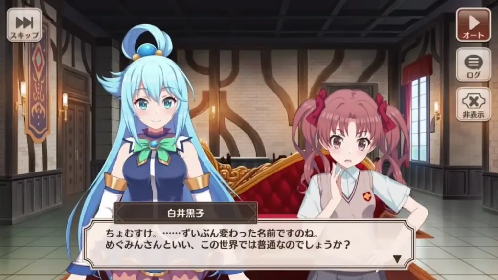
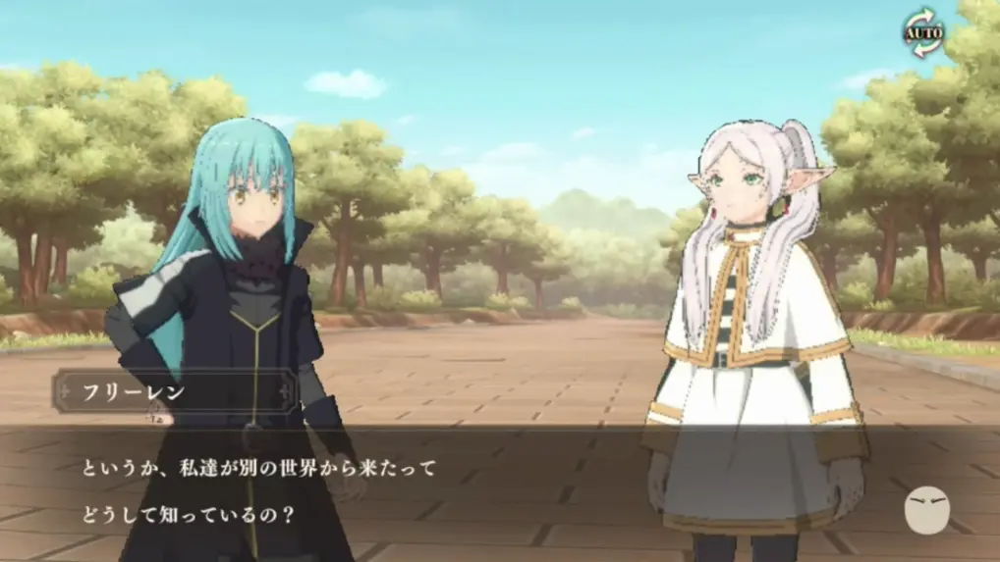
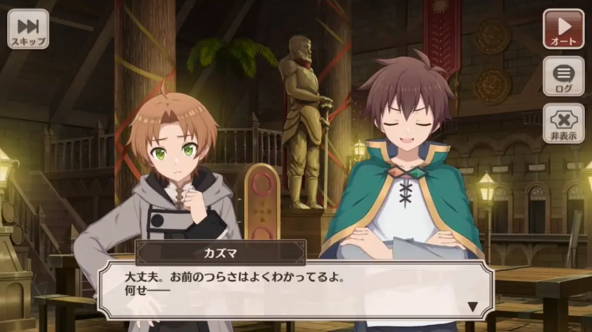

# 劇本設計

## 遊戲引擎
### 舉例
* 

### Homework 
* 嘗試幾個遊戲引擎 找到一個你順手的

## 劇本設計

### Scriptwriting
* 發想

* 世界觀(背景)
    * 畫面要視線收束設計

* 先讓英雄救貓咪 
    * Save the Cat Beat Sheet
    * 

### Homework

* 分析一部作品 可以是 電影/小說/動畫/漫畫
    * 嘗試使用三幕劇架構解構
        * 細化成 Beat Sheet

* 寫一份發想 -> 劇本

## 人物設計

### Charctor
* 主角 vs 路人

* 把他們放在幾個背景下彼此互動
    * 
    * 
    * 

### Homework

* 設計數個主角 路人

* 把他們放在幾個背景下彼此互動

## 放入遊戲中

### Homework

* 設計量體
  * 規劃時程
    * 總工時
    * 不同單位時程 ex: 繪畫, 劇本設計, 放入引擎中
  * check point
* 製作成品

### 各種工具介紹

* Ren'Py

